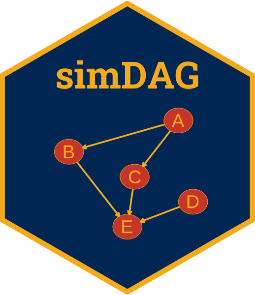
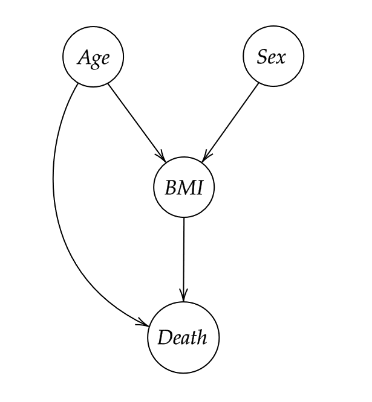

<!-- README.md is generated from README.Rmd. Please edit that file -->

```{r, include = FALSE}
knitr::opts_chunk$set(
  collapse = TRUE,
  comment = "#>",
  fig.path = "man/figures/README-",
  out.width = "100%"
)
```

<!-- badges: start -->
[](https://www.repostatus.org/#active)
[](https://cran.r-project.org/package=simDAG)
[](https://cran.r-project.org/package=simDAG)
[](https://github.com/RobinDenz1/simDAG/actions/workflows/R-CMD-check.yaml)
[](https://app.codecov.io/gh/RobinDenz1/simDAG)
<!-- badges: end -->

# simDAG 

Author: Robin Denz

## Description

`simDAG` is an R-Package which can be used to generate data from a known directed acyclic graph (DAG) with associated information on distributions and causal coefficients. The root nodes are sampled first and each subsequent child node is generated according to a regression model (linear, logistic, multinomial, cox, ...) or other function. The result is a dataset that has the same causal structure as the specified DAG and by expectation the same distributions and coefficients as initially specified. It also implements a comprehensive framework for conducting discrete-time simulations in a similar fashion.

## Installation

A stable version of this package can be installed from CRAN:

```R
install.packages("simDAG")
```

and the developmental version may be installed from github using the `remotes` R-Package:

```R
library(remotes)

remotes::install_github("RobinDenz1/simDAG")
```

## Bug Reports and Feature Requests

If you encounter any bugs or have any specific feature requests, please file an [Issue](https://github.com/RobinDenz1/simDAG/issues).

## Examples

Suppose we want to generate data with the following causal structure:

<p align="center">
	
</p>

where `age` is normally distributed with a mean of 50 and a standard deviation of 4 and `sex` is bernoulli distributed with `p = 0.5` (equal number of men and women). Both of these "root nodes" (meaning they have no parents - no arrows pointing into them) have a direct causal effect on the `bmi`. The causal coefficients are 1.1 and 0.4 respectively, with an intercept of 12 and a sigma standard deviation of 2. `death` is modeled as a bernoulli variable, which is caused by both `age` and `bmi` with causal coefficients of 0.1 and 0.3 respectively. As intercept we use -15.

The following code can be used to generate 10000 samples from these specifications:

```{r}
library(simDAG)

dag <- empty_dag() +
  node("age", type="rnorm", mean=50, sd=4) +
  node("sex", type="rbernoulli", p=0.5) +
  node("bmi", type="gaussian", formula= ~ 12 + age*1.1 + sex*0.4, error=2) +
  node("death", type="binomial", formula= ~ -15 + age*0.1 + bmi*0.3)

set.seed(42)

sim_dat <- sim_from_dag(dag, n_sim=100000)
```

By fitting appropriate regression models, we can check if the data really does approximately conform to our specifications. First, lets look at the `bmi`:

```{r}
mod_bmi <- glm(bmi ~ age + sex, data=sim_dat, family="gaussian")
summary(mod_bmi)
```

This seems about right. Now we look at `death`:

```{r}
mod_death <- glm(death ~ age + bmi, data=sim_dat, family="binomial")
summary(mod_death)
```

The estimated coefficients are also very close to the ones we specified. More examples can be found in the documentation and the vignette.

## Citation

If you use this package, please cite the associated article:

Denz, Robin and Nina Timmesfeld (2025). Simulating Complex Crossectional and Longitudinal Data using the simDAG R Package. arXiv preprint, doi: 10.48550/arXiv.2506.01498.

## License

© 2024 Robin Denz

The contents of this repository are distributed under the GNU General Public License. You can find the full text of this License in this github repository. Alternatively, see <http://www.gnu.org/licenses/>.
