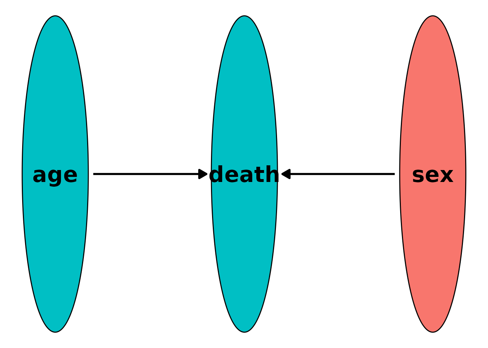

# Simulating Data using a Discrete-Time Approach

## Introduction

In this small vignette, we introduce the
[`sim_discrete_time()`](https://robindenz1.github.io/simDAG/reference/sim_discrete_time.md)
function, which can be used to generate arbitrarily complex longitudinal
data with discrete points in time. Just as the
[`sim_from_dag()`](https://robindenz1.github.io/simDAG/reference/sim_from_DAG.md)
function contained in this package, it allows any mixture of continuous,
binary, categorical, count, or time-to-event data. The main advantage of
the
[`sim_discrete_time()`](https://robindenz1.github.io/simDAG/reference/sim_discrete_time.md)
function is that it naturally generates longitudinal data without the
need to define a node for each variable at each point in time. It also
makes the generation of complex time-to-event data a lot easier.
Features such as time-dependent effects, time-dependent covariates, any
form of censoring, recurrent-events and competing events may be included
in a straightforward fashion (Denz and Timmesfeld 2025).

## What is Discrete-Time Simulation and Why Use it?

A discrete-time simulation (DTS) consists of two steps. First, a bunch
of entities (usually but not necessarily people) are created.
Afterwards, the change of the states of these entities over time is
simulated by increasing the simulation time iteratively in discrete
steps, updating the states at each step (Tang et al. 2020). For example,
suppose that the entities are people and that we are interested in the
states `age` and `death`. Every time the simulation time increases, the
`age` of each person increases with it, raising the probability of
death. At every step we check if each person is still alive. If they
die, the state of `death` changes from 0 to 1. If everyone is dead, we
stop the simulation. The schematic flow of DTS is shown in the figure
below.


A generalized flow-chart of the discrete-time simulation approach

The
[`sim_discrete_time()`](https://robindenz1.github.io/simDAG/reference/sim_discrete_time.md)
directly implements this workflow. A data set at $t = 0$ is either
simulated using the
[`sim_from_dag()`](https://robindenz1.github.io/simDAG/reference/sim_from_DAG.md)
function or supplied directly by the user (using the `t0_data`
argument). This data set is then updated according to the time-dependent
nodes added to the `dag` using
[`node_td()`](https://robindenz1.github.io/simDAG/reference/node.md)
calls. Below we give a short example on how this works in practice. A
more realistic (and therefore more complex) example can be found in a
different vignette.

A DTS can be seen as a special case of simulation modeling. It is
closely related to *dynamic microsimulation* (Spooner et al. 2021),
*discrete-event simulation* (Banks 2014) and *agent-based modeling*
(Ugur & Saka 2006). As such, it requires a lot of input from the users.
In general, the
[`sim_discrete_time()`](https://robindenz1.github.io/simDAG/reference/sim_discrete_time.md)
function is not an “off-the-shelves” function which can be used “as-is”
to simulate data. In most cases, the user needs to write their own
functions to actually use this function effectively. This is the price
one has to pay for the nearly unlimited flexibility of this simulation
methodology. Nevertheless, it may be the only valid simulation strategy
when the user is interested in highly complex longitudinal time-to-event
data.

## Defining the DAG

Similar to the
[`sim_from_dag()`](https://robindenz1.github.io/simDAG/reference/sim_from_DAG.md)
function, the user needs to specify the nodes of the underlying causal
DAG to use this function. All variables in a DTS can be categorized into
three categories: *t0_root nodes*, *t0_child_nodes* and *tx_nodes*.

- *t0_root_nodes*: Variables that are completely independent of all
  other variables and are only generated once are called
  *t0_root_nodes*. This could be something like sex or geographic
  entities. They are generally simply sampled from some previously
  defined distribution, but they could also be sampled directly from
  existing data. The prefix *t0\_* indicates that these variables are
  created only once in the beginning.

- *t0_child_nodes*: Much like *t0_root_nodes*, the *t0_child_nodes* are
  also variables that are generated only once in the beginning of the
  discrete-time simulation. The only difference is, that these variables
  are not simply sampled from a defined distribution. Instead they
  causally depend in some way on other variables. Those other variables
  can be root nodes or other child nodes, as long as the underlying
  causal structure can be described as a directed acyclic graph.

- *tx_nodes*: This type of node is more complex and is the reason to use
  DTS. Variables in this category are updated at each step in time of
  the simulation process. These updates can be fairly easy, such as
  increasing the age of a person by one time unit on each step, or they
  can be very complex. For example, if we want to model the occurrence
  of some kind of time-dependent-event, we can generate the probability
  of that occurrence at each step depending on other variables in the
  simulation model or past states of the variable itself.

The `t0_root_nodes` and `t0_child_nodes` arguments are specified using a
`DAG` object and calls to the
[`node()`](https://robindenz1.github.io/simDAG/reference/node.md)
function as usual when using the
[`sim_from_dag()`](https://robindenz1.github.io/simDAG/reference/sim_from_DAG.md)
function. In fact, they are simply passed to it under the hood. Their
role in the data generation process is only to obtain the initial data
set we need for $t = 0$. It would be equivalent to call the
[`sim_from_dag()`](https://robindenz1.github.io/simDAG/reference/sim_from_DAG.md)
function manually and then pass the output to the `t0_data` argument. We
therefore won’t go into more detail here. More information about how to
correctly specify this DAG can be found in the documentation of the
[`sim_from_dag()`](https://robindenz1.github.io/simDAG/reference/sim_from_DAG.md)
and [`node()`](https://robindenz1.github.io/simDAG/reference/node.md)
functions or the associated vignette.

## A Simple Example - One Terminal Event

Let us consider a very simple example first. Suppose we want to generate
data according to the following causal DAG:


A small DAG with time-varying age

Here, $A$, which stands for `sex`, is a time-invariant variable, whereas
$B$ (`age`) and $D$ (`death`) are not. Suppose that each tick of the
simulation corresponds to a duration of one year. Then, naturally,
people will age one year on every simulation tick. We assume that `sex`
and `age` have a direct causal effect on the probability of death,
regardless of the time. Once people are dead, they stay dead (no
reincarnation allowed).

If we want to use this structure in the
[`sim_discrete_time()`](https://robindenz1.github.io/simDAG/reference/sim_discrete_time.md)
function, we first have to generate an initial dataset for the state of
the population at $t = 0$ as described above. We do this by first
specifying the `t0_root_nodes` as follows:

``` r
library(data.table)
library(ggplot2)
library(simDAG)

dag <- empty_dag() +
  node("age", type="rnorm", mean=30, sd=5) +
  node("sex", type="rbernoulli", p=0.5)
```

We assume that `age` is normally distributed and that we have equal
numbers of each `sex`. This information is enough to specify the data
set at $t = 0$. Now we only need to add additional time-dependent nodes
using the
[`node_td()`](https://robindenz1.github.io/simDAG/reference/node.md)
function and we are ready. First, we define a function that increases
the age of all individuals by 1 at each step:

``` r
node_advance_age <- function(data) {
  return(data$age + 1)
}
```

Next, we need to define a function that will return the probability of
`death` for every individual at time $t$, given their current `age` and
their `sex`. We use a logistic regression model, but make it explicit
for exemplary reasons:

``` r
prob_death <- function(data) {
  score <- -10 + 0.15 * data$age + 0.25 * data$sex
  prob <- 1/(1 + exp(-score))
  return(prob)
}
```

Now we can add those nodes to the `DAG` as follows:

``` r
dag <- dag +
  node_td("age", type="advance_age", parents="age") +
  node_td("death", type="time_to_event", parents=c("age", "sex"),
          prob_fun=prob_death, event_duration=Inf, save_past_events=TRUE,
          check_inputs=FALSE)
```

We simply pass the `node_advance_age()` function to the `type` argument
of the `age` node. `death` is a *time-to-event* node, because it’s an
event which is generated from a probability at each step in time. That
probability, as defined here, is determined by the `prob_death` function
we defined earlier. We set `event_duration` to `Inf` to make this a
permanent event (once you are dead, there is no going back).

To visualize the resulting DAG, we can use the associated
[`plot()`](https://rdrr.io/r/graphics/plot.default.html) method:

``` r
plot(dag)
```



To finally generate the desired data, we simply call the
[`sim_discrete_time()`](https://robindenz1.github.io/simDAG/reference/sim_discrete_time.md)
function:

``` r
set.seed(43)
sim_dat <- sim_discrete_time(n_sim=10, dag=dag, max_t=50, check_inputs=FALSE)
```

By setting `max_t=50`, we are letting this simulation run for 50
(simulated) years. The results look like this:

``` r
head(sim_dat$data)
#>         age    sex death_event death_time   .id
#>       <num> <lgcl>      <lgcl>      <int> <int>
#> 1: 79.81243   TRUE        TRUE         27     1
#> 2: 72.12698   TRUE        TRUE         13     2
#> 3: 77.57016  FALSE        TRUE         31     3
#> 4: 82.32593  FALSE        TRUE         16     4
#> 5: 75.47951  FALSE        TRUE         17     5
#> 6: 78.61284  FALSE        TRUE          9     6
```

It is easy to see that all people died over the course of those 50 years
by looking at the `death_event` column. The `death_time` column records
the time at which each person died.

If we want to graphically display a flow diagram of the data-generation
mechanism, we may use the
[`plot()`](https://rdrr.io/r/graphics/plot.default.html) method
associated with the output of the
[`sim_discrete_time()`](https://robindenz1.github.io/simDAG/reference/sim_discrete_time.md)
function like this:

``` r
plot(sim_dat)
```


This particular example could be simulated in a much easier fashion,
without relying on a discrete-time approach, because `age` increases
linearly and the model for `death` is exactly the same regardless of
time. DTS is more useful when truly complex data structures are
required. Below we will extend this simple example a little bit, but we
will still keep it relatively simple.

## Extending the Simple Example - Recurrent Events

Suppose that the event of interest wasn’t `death`, but a cardiovascular
event (`cve`). For the case of simplicity we will assume that the same
causal structure and causal coefficients from above still apply, but
that the event is now no longer terminal and may re-occur an arbitrary
number of times. First, let’s redefine the nodes to get the new name
right:

``` r
dag <- empty_dag() +
  node("age", type="rnorm", mean=30, sd=5) +
  node("sex", type="rbernoulli", p=0.5)
```

We also redefine the function that generates the required event
probabilities:

``` r
prob_cve <- function(data) {
  score <- -15 + 0.15 * data$age + 0.25 * data$sex
  prob <- 1/(1 + exp(-score))
  return(prob)
}
```

Now, all we have to do in this case is change some arguments of the
[`node_time_to_event()`](https://robindenz1.github.io/simDAG/reference/node_time_to_event.md)
function:

``` r
dag <- dag +
  node_td("age", type="advance_age", parents=c("age")) +
  node_td("cve", type="time_to_event", parents=c("age", "sex"),
          prob_fun=prob_cve, event_duration=1, save_past_events=TRUE)
```

Apart from changing the node name, we also changed the `event_duration`
parameter to 1, meaning that a cardiovascular event only lasts 1 year.
We also set `save_past_events` to `TRUE` in order to store the possible
recurrent events. Now we call the
[`sim_discrete_time()`](https://robindenz1.github.io/simDAG/reference/sim_discrete_time.md)
function as before:

``` r
sim_dat <- sim_discrete_time(n_sim=10, dag=dag, max_t=50)
head(sim_dat$data)
#>         age    sex cve_event cve_time   .id
#>       <num> <lgcl>    <lgcl>    <int> <int>
#> 1: 82.67833   TRUE     FALSE       NA     1
#> 2: 90.30020  FALSE      TRUE       50     2
#> 3: 88.25512   TRUE     FALSE       NA     3
#> 4: 90.28344  FALSE     FALSE       NA     4
#> 5: 79.90450   TRUE     FALSE       NA     5
#> 6: 81.70720   TRUE     FALSE       NA     6
```

In this case, the data is a little more complex. At time $t = 50$, only
one person is currently experiencing a cardiovascular event, which is
why the `cve_event` column is `FALSE` in almost all rows and the
`cve_time` column is `NA` in almost all rows. We need to transform this
output data into different formats using the
[`sim2data()`](https://robindenz1.github.io/simDAG/reference/sim2data.md)
function to gain more information.

For example, we can transform it into the start-stop format:

``` r
d_start_stop <- sim2data(sim_dat, to="start_stop")
head(d_start_stop)
#>      .id start  stop    cve      age    sex
#>    <int> <int> <num> <lgcl>    <num> <lgcl>
#> 1:     1     1    50  FALSE 82.67833   TRUE
#> 2:     2     1    43  FALSE 90.30020  FALSE
#> 3:     2    44    44   TRUE 90.30020  FALSE
#> 4:     2    45    49  FALSE 90.30020  FALSE
#> 5:     2    50    50   TRUE 90.30020  FALSE
#> 6:     3     1    50  FALSE 88.25512   TRUE
```

In this format, we can clearly see when the events occurred. This type
of format is usually used to fit statistical models for time-to-event
data (although before fitting those, you might want to take a look at
the `target_event`, `overlap` and `keep_only_first` arguments of
[`sim2data()`](https://robindenz1.github.io/simDAG/reference/sim2data.md)).
Another possibility is to transform it into the long-format:

``` r
d_long <- sim2data(sim_dat, to="long")
head(d_long)
#> Key: <.id, .time>
#>      .id .time    cve      age    sex
#>    <int> <int> <lgcl>    <num> <lgcl>
#> 1:     1     1  FALSE 82.67833   TRUE
#> 2:     1     2  FALSE 82.67833   TRUE
#> 3:     1     3  FALSE 82.67833   TRUE
#> 4:     1     4  FALSE 82.67833   TRUE
#> 5:     1     5  FALSE 82.67833   TRUE
#> 6:     1     6  FALSE 82.67833   TRUE
```

This may also be useful to fit discrete-time survival models.

The simulation done here assumes that the time and number of previous
events has no effect on any further events of the patient. This
assumption may be relaxed by explicitly formulating the `prob_cve`
function in a way that it uses the `cve_time` column to change the
probability of further events. A more in-depth example that includes
considerations like these can be found in the third vignette of this
package.

## References

Denz, Robin and Nina Timmesfeld (2025). Simulating Complex Crossectional
and Longitudinal Data using the simDAG R Package. arXiv preprint, doi:
10.48550/arXiv.2506.01498.

Banks, Jerry, John S. Carson II, Barry L. Nelson, and David M. Nicol
(2014). Discrete-Event System Simulation. Vol. 5. Edinburgh Gate:
Pearson Education Limited.

Bilge, Ugur and Osman Saka (2006). “Agent Based Simulations in
Healthcare”. In: Ubiquity: Technologies for Better Health in Aging
Societies - Proceedings of MIE2006. Ed. by Arie Hassman, Reinhold Haux,
Johan van der Lei, Etienne De Clercq, and Francis H. Roger France. IOS
Press.

Spooner, Fiona, Jesse F. Abrams, Karyn Morrissey, Gavin Shaddick,
Michael Batty, Richard Milton, Adam Dennett, Nik Lomax, Nick Malleson,
Natalie Nelissen, Alex Coleman, Jamil Nur, Ying Jin, Rory Greig, Charlie
Shenton, and Mark Birkin (2021). “A Dynamic Microsimulation Model for
Epidemics”. In: Social Science & Medicine 291.114461.

Tang, Jiangjun, George Leu, und Hussein A. Abbass. 2020. Simulation and
Computational Red Teaming for Problem Solving. Hoboken: IEEE Press.
