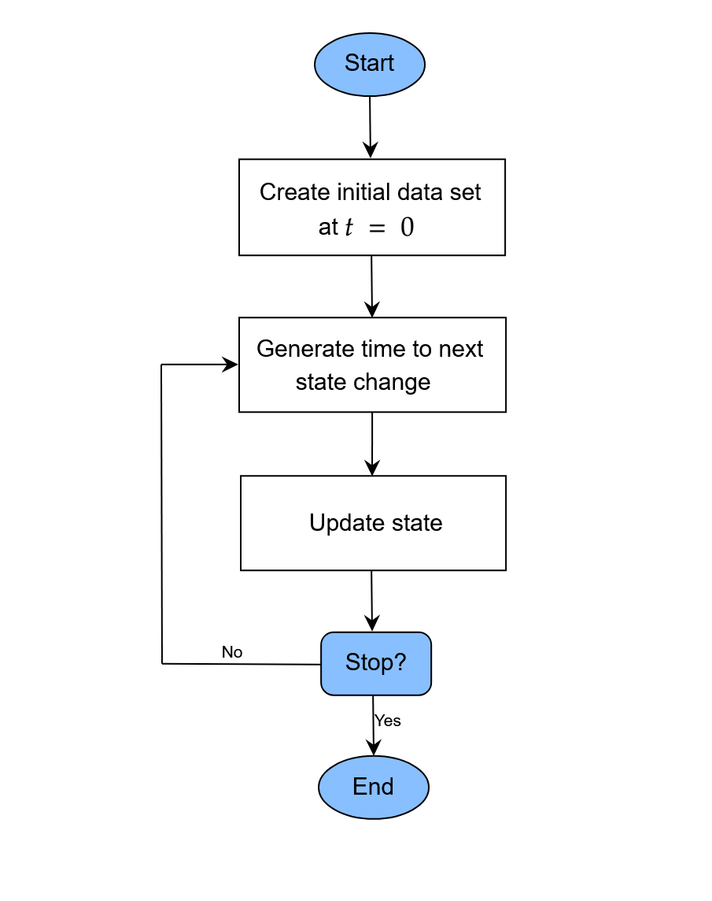

```{r, include=FALSE}
knitr::opts_chunk$set(
  collapse=TRUE,
  comment="#>"
)
```

# Introduction

In this small vignette, we introduce the `sim_discrete_event()` function, which can be used to generate complex longitudinal data with a continuous time scale based on the discrete-event simulation (DES) framework [@Banks2014]. It is very similar to the `sim_discrete_time()` function in spirit, but relies on a completely different algorithm to generate the data. This algorithm is usually much faster than the discrete-time approach, while also being more precise. The drawback is some added complexity and a little less flexibility. For example, in `sim_discrete_event()`, continuous, categorical or count-based time-dependent variables are currently not supported. Only binary variables added using the `"next_time"` node type may be used. 

The goal of the `sim_discrete_event()` function is not to provide a general framework for DES. Multiple other R packages, such as `simmer` [@Ucar2019; @Degeling2025] and `DES` [@Matloff2017], as well as software packages outside R have been developed for that purpose and are much more useful in this regard. Instead, the aim of this function is to provide a specific, but fairly general, DES model that may be used to generate data from DAG based description of the data generation process (DGP). In other words: if you want to perform a classic DES with interacting agents using a classic simulation modeling approach, this is probably not the right package for you. If you want to generate complex time-dependent data based on a stochastic model, you have come to the right place. 

Throughout the vignette, we assume that the reader is already familiar with the `simDAG` syntax. If this is not the case, we recommend consulting the introductory vignette or the main paper associated with this package first [@Denz2025].

# What is Discrete-Event Simulation and Why Use it?

In a discrete-event simulation (DES), the data is generated according to a statistical model, which describes a system as a sequence of distinct (or discrete) events that happen in continuous time and may influence each other. Any DES starts with the generation of $n$ individuals at $t = 0$ that have some characteristics, such as values of multiple covariates. The full description of all individuals is considered to be the *state* of the simulation here. This *state* only ever changes when some *event* occurs. A simple example for an *event* would be a variable changing its value from `FALSE` to `TRUE` or vice versa. If such an event occurs, the time of the simulation is advanced to the timing of this event. The state of the simulation is then updated to reflect the changes brought on by this event. Next, the time until the next event is generated and the process is repeated until some condition is met. The flowchart below gives a generalized description of a DES as considered here.

```{r, include=TRUE, fig.align="center", fig.cap=c("A generalized flow-chart of the discrete-event simulation approach"), echo=FALSE, out.width=500}

```

This approach has many names and usages in the literature. In physics and chemistry, the particular variant discussed here is known as the Gillespie algorithm [@Gillespie1976; @Gillespie1977], or the *next reaction* or *first reaction* method [@Anderson2007]. Formally, it is a mathematically exact method to generate random trajectories from a known (not necessarily Markovian) stochastic process [@Masuda2018]. Formal descriptions of the algorithm are given in the cited literature. The most general description of the DES (or Gillespie algorithm) implemented in `sim_discrete_event()` is as follows for every individual:

* (1) At $t = 0$, initialize the baseline covariate values and set all $m$ time-dependent covariates to `FALSE`.
* (2) For each of the $m$ considered time-dependent variables, generate the time until the next change based on some distributional assumptions (possibly dependent on any variables contained in the current state)
* (3) Advance the simulation to the minimum of the values drawn in step (2).
* (4) Update the value of the time-dependent variable that generated this event.
* (5) Go back to step (2) and repeat until either some condition is met or no changes are possibly anymore (may happen is every time-dependent variable has reached a terminal state).

The `sim_discrete_event()` directly implements this workflow, assuming that individuals (rows in the `data`) do not influence each other. A data set at $t = 0$ is either simulated using the `sim_from_dag()` function or supplied directly by the user (using the `t0_data` argument). This data set is then updated according to the time-dependent nodes added to the `dag` using `node_td()` calls. After each update, the state of the simulation is saved, so that the final output is a single dataset in the start-stop format. Below we give a short example on how this works in practice. We use a similar example to the one used in the discrete-time simulation vignette, to allow direct comparisons with the discrete-time approach.

# Defining the DAG

As for the other simulation functions in this package, the definition of a DAG is the first required step. Any amount of time-independent variables specified using standard `node()` function calls are supported. Time-dependent nodes should be specified using the `node_td()` function instead. Importantly, for `sim_discrete_event()`, only time-dependent nodes of type `"next_time"` are supported. For more examples and guidance on how to generally define a DAG, please consult the other vignettes and documentation pages of this package.

# A single time-dependent variable

For illustrative purposes, we will start with a small comparison of the discrete-time simulation approach and the discrete-event approach. Consider that we are interested in simulating the time until `death` for $n$ individuals. Lets ignore the influence of any other variables for the moment and just consider `death` by itself. Suppose that `death` has a fixed probability of 0.01 to occur during each time-unit.

## Discrete-Time approach

In a discrete-time simulation, we would simply draw Bernoulli trials with a probability of 0.01 at $t$. If the trial returns a 1, we are done and save the time. If it returns a 0, we increase $t$ by one and repeat until we are finished. This can be done using the `sim_discrete_time()` function using the following code:

```{r}
library(simDAG)
library(data.table)

set.seed(1234)

dag_dts <- empty_dag() +
  node_td("death", type="time_to_event", prob_fun=0.01, event_duration=Inf)

simDTS <- sim_discrete_time(dag_dts, n_sim=10, max_t=10000000,
                            break_if=all(data$death_event==TRUE))
head(simDTS$data)
```

Here, we set the `max_t` argument to a very large number and told the function to stop once everyone has died using the `break_if` argument. This approach works well, but it is also incredibly inefficient in this simple example. Since `death` has a constant probability of 0.01, we could also simply sample time values from an exponential distribution with `rate=0.01`. This is exactly what will be exploited in the DES approach.

## Discrete-Event approach

Since we are only interested in a single variable, which has a terminal state (once you are dead, there is no going back), we only need one time-jump and thus only one iteration in the DES approach, while we needed potentially hundreds or thousands in the discrete-time approach. The following code may be used to implement this:

```{r}
dag_des <- empty_dag() +
  node_td("death", type="next_time", prob_fun=0.01,
          event_duration=Inf)

simDES <- sim_discrete_event(dag_des, n_sim=10, target_event="death")
head(simDES)
```

There are some differences to the output of the `sim_discrete_time()` function. First, because we are using the DES approach, the time is continuous and not discrete. Secondly, the output is naturally in the start-stop format, because there would be no other useful way to represent it. Because there is only one change, each individual only has one row in the dataset and it is thus still almost equivalent to the output of the discrete-time approach.

In this example the `sim_discrete_event()` output is exactly equal to just calling `rexp(10, rate=0.01)`, while the `sim_discrete_time()` output is a discrete-time approximation to it.

# Two interrelated time-dependent variables

We will now make the example a little more complex, by including a time-dependent variable which directly influences the probability of death. Consider the following code:

```{r}
prob_death <- function(data) {
  0.001 * 0.8^(data$treatment)
}

dag <- empty_dag() +
  node_td("treatment", type="next_time", prob_fun=0.01,
          event_duration=100) +
  node_td("death", type="next_time", prob_fun=prob_death,
          event_duration=Inf)

sim <- sim_discrete_event(dag, n_sim=10, remove_if=death==TRUE,
                          target_event="death")
```

Here, we specified two time-dependent nodes of type `"next_time"`. The first one denotes the `treatment`, which has a fixed probability of being given to a person. It then has an effect for 100 time units, after which the variable turns back to `FALSE`. Once it is `FALSE` again, it may be given to the same person again immediatly, with a probability of 0.01. The probability of the `death` of a person is now no longer fixed, but a function of the `treatment` status. The general probability of death is 0.001 per time unit, but it is reduced by a factor of 0.8 if the `treatment` is currently in effect.

Importantly, in this simulation we had to use one of the three arguments that define an end of the simulation: `max_t`, `remove_if` or `break_if`. We specified `remove_if`, so that all individuals who die are no longer part of the simulation. Alternatively, we could have gotten a similar effect using the `break_if` argument, or limit the amount of time the simulation may run with `max_t`. The latter is not very useful here, because we are interested in the time of death. If we hadn't used any of these arguments, the simulation would be updated exactly `1000` times per person (default value of the `max_loops` argument), because `treatment` does not have a terminal state (both its `event_duration` and `immunity_duration` are finite). The `target_event` argument is only used to make the output a little prettier.

The generated data for the first individual look like this:

```{r}
head(sim, 9)
```

As can be seen, the treatment keeps switching between `TRUE` and `FALSE` until the `death` is eventually reached. If we increased `n_sim` and fit a Cox proportional hazards regression model with the time-to `death` as the endpoint and the `treatment` as covariate, we would be able to recover the 0.8 as the hazard ratio for the treatment. The same strategy could of course be used for any amount of time-varying variables.

# Some things to consider

## Time-Dependent probabilities and effects

By default, the time until the next event is generated using a random draw from an exponential distribution. This approach, however, assumes that the probability of occurrence is independent of the time. We can relax this assumption by using the `redraw_at_t` argument. This argument allows users to specify points in time at which the time to the next event should be re-drawn. By additionally making the probability function supplied to a time-dependent node time-specific, we can then use a piecewise-constant probability instead. Consider the following code:

```{r}
prob_death <- function(data) {
  
  base_p <- fifelse(data$.time > 300, 0.005, 0.001)
  
  base_p * 0.8^(data$treatment)
}

dag <- empty_dag() +
  node_td("treatment", type="next_time", prob_fun=0.01,
          event_duration=100) +
  node_td("death", type="next_time", prob_fun=prob_death,
          event_duration=Inf)

sim <- sim_discrete_event(dag, n_sim=10, remove_if=death==TRUE,
                          target_event="death", redraw_at_t=300)
head(sim)
```

In this code, the baseline probability is 0.001 until $t = 300$ and then increases to 0.005. It is not sufficient to only define the probability function this way, because then there would be no way for the simulation itself to know that the event durations have to be re-drawn. For example, lets say the `death` time drawn at $t = 0$ for some person is 678 and assume that `treatment` has no effect for this individual. This time was generated using a rate of 0.001, so only the time until 300 is valid. At $t = 300$, we therefore have to re-draw another time from a truncated exponential distribution with the new rate of 0.005 (truncated at 300).

The same strategy could be used to define piecewise-constant time-dependent effects as well. One would only need to adjust the `prob_death()` function so that it has a different factor for `treatment` depending on the time. Using continuously changing probabilities is more difficult, but possible. If for example, we assume that the baseline probability follows a Weibull distribution, we could use the same algorithm that is used in the `node_cox()` function to draw the event times instead. This could be done by changing the `distr_fun` argument inside the relevant `node_td()` call appropriately.

## Categorical / Count / Continuous variables

With the current implementation, only time-dependent variables are supported. There is no way to easily integrate time-dependent categorical, count or continuous variables instead. If these are required, users may need to use the `sim_discrete_time()` function.

## Ties in event times

Conceptually, no complications arise from multiple events happening at the same exact time, which we will call *ties* from here on. If ties occur, the algorithm should simply update the respective variables at the same time, generating only one new row for the start-stop dataset. The simulation may then proceed as usual. Computationally, it does make a difference though. The `sim_discrete_event()` function internally uses a mix of a long- and wide-format dataset. Updating this dataset is fast and efficient if it can be assumed that only one event occurs, but somewhat more involved if we have to allow ties. This is where the `allow_ties` argument comes in.
 
By default, the time until the next event is drawn from a (truncated) exponential distribution and thus truly continuous. In this case, the likelihood that two generated event times, lets say for variable $A$ and $B$ are exactly equal are astronomically small. For all intents and purposes, we may ignore this possibility. The `allow_ties` argument is therefore set to `FALSE` by default, allowing computations to be a lot faster. If, however, the user supplies a custom function that generates integer based times, this argument needs to be set to `TRUE` (otherwise an error will be returned).

For example, consider the following code:

```{r}
prob_death <- function(data) {
  0.001 * 0.8^(data$treatment)
}

integer_rtexp <- function(n, rate, l) {
  ceiling(rtexp(n=n, rate=rate, l=l))
}

dag <- empty_dag() +
  node_td("treatment", type="next_time", prob_fun=0.01,
          event_duration=100, distr_fun=integer_rtexp) +
  node_td("death", type="next_time", prob_fun=prob_death,
          event_duration=Inf, distr_fun=integer_rtexp)

sim <- sim_discrete_event(dag, n_sim=1000, remove_if=death==TRUE,
                          target_event="death", allow_ties=TRUE)
```

Here, we use an artificially discretized version of the truncated exponential distribution to generate the time until the next change. This may lead to ties, so we need to set `allow_ties=TRUE`. Note that for sample sizes below 10000, the computational differences are very small. Only with large `n_sim` does the difference between `allow_ties=TRUE` and `allow_ties=FALSE` become more noticeable.

# Discussion

The `sim_discrete_event()` function has multiple advantages over its sibling, the `sim_discrete_time()` function. As a general rule, if a DGP can be described in terms of only binary time-dependent variables (plus an arbitrary amount of time-constant variable) it should be possibly to use both functions. In this case, the `sim_discrete_event()` approach is often much faster and more efficient and thus preferable. If more complex data is required, the discrete-time simulation approach offers more flexibility, while also being easier to understand, at the cost of computational time.

# References
