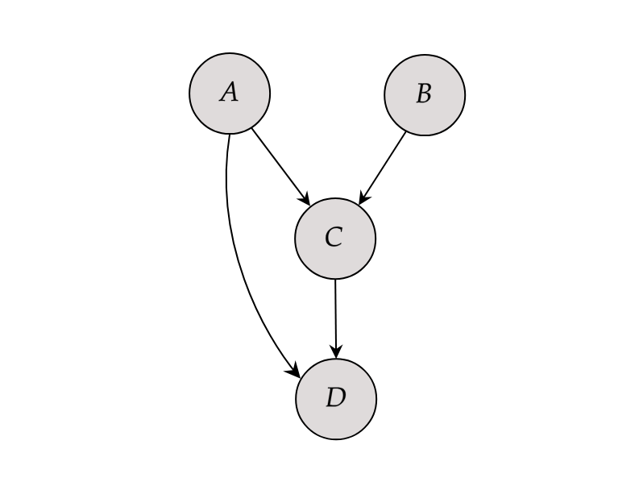

```{r, include=FALSE}
knitr::opts_chunk$set(
  collapse=TRUE,
  comment="#>",
  fig.align="center"
)
```

# Introduction

In this small vignette, we introduce the `sim_from_dag()` function, which can be used to simulate complex data from arbitrary causal directed acyclic graphs (DAGs). The simulated data may include continuous, binary, categorical, count or time-to-event variables. This function is most useful if the DAG is static, meaning that there are no time-varying variables. It is theoretically possible to use this function to simulate data from DAGs with a time structure as well, but there are some difficulties associated with it that will be discussed later.

# What are causal DAGs and why use them?

A causal DAG is a DAG in which all nodes correspond to variables and the directed edges correspond to direct causal relationships between these variables. A direct edge from node $A$ to node $B$ implies that there is direct causal effect of $A$ on $B$. On the other hand, if there is no edge from node $A$ to node $B$, there is no direct causal relationship between these variables. Using a DAG in this way makes it easy to encode the causal structure of a given system, which is very useful for causal inference. This general idea is a centerpiece of the **structural approach** to causality developed by Pearl (2002) and Spirtes et al. (1993). We strongly encourage the reader to make themselves familiar with some of this literature before moving on.

It is very simple to generate data from a defined causal DAG. To see why we first need to introduce the concept of **root nodes** and **child nodes**. A root node is a node in a DAG that does not have any edges pointing to it (no incoming arrows). A child node on the other hand is a node that has at least one incoming edge. In other words, root nodes have no direct causes but child nodes do. Every node pointing into another node is considered a **parent** of that child node. For example, consider the DAG in figure 1.

```{r, include=TRUE, fig.align="center", fig.cap=c("A small DAG with four nodes"), echo=FALSE, out.width=400}

```

Nodes $A$ and $B$ are root nodes because they do not have any directed edges pointing into them. Nodes $C$ and $D$ on the other hand are child nodes. The parents of node $C$ are both $A$ and $B$ because both of these nodes have directed edge towards $C$. Note that node $B$ is not a parent of node $D$ because there is no edge from $B$ to $D$.

As the name implies, DAGs do not have cycles. Therefore every DAG has at least one root node. Generating data for these nodes is the first step to simulate data for the whole DAG. Since root nodes have no parents, we can simply generate random data from them using an appropriate distribution. Once we have data for all root nodes, we can generate their directly connected child nodes next as a function of the root nodes (and perhaps additional random error). These direct child nodes are then used as input for the next child nodes in line and so on. This continues until every node has been generated. Since every DAG can be topologically sorted (Chickering 1995), this will *always* work. All we need is to specify the DAG and the functional relationship between each node and its parents. 


# Defining the DAG

Because the `sim_from_dag()` function uses the method described above, it requires information about the causal structure and the exact form of the relationship between child nodes and their parents. All of this information has to be included in the `dag` argument, which should be a `DAG` object created using the `empty_dag()` function and grown using `node()` calls as described below. This can be done completely manually (which is the usual strategy when conducting simulation studies) or (partially) using existing data (which may be useful when the interest is in getting a toy data set resembling real data as closely as possible).

Regardless of which strategy you want to use, first you have to initialize an empty `DAG` object like this:

```{r}
library(data.table)
library(ggplot2)
library(simDAG)

dag <- empty_dag()
```

Afterwards you can add an unlimited amount of root nodes and child nodes to it. Multiple different types are implemented.

## Root node types

The values for the `root_nodes` are simply sampled from some defined distributions. Therefore, any function that generates random draws from some distribution may be used here. Popular alternatives for continuous data are the normal-, beta-, gamma-distributions which are implemented in base R inside the `rnorm()`, `rbeta()` and `rgamma()` functions. For binary or categorical data we could use the custom functions `rbernoulli()` or `rcategorical()` instead.

## Child node types

The `simDAG` package implements the following types of `child_nodes` directly:

* `node_gaussian`: A node based on linear regression (continuous data).
* `node_binomial`: A node based on logistic regression (binary data).
* `node_multinomial`: A node based on multinomial logistic regression (categorical data).
* `node_poisson`: A node based on poisson regression (count data).
* `node_negative_binomial`: A node based on negative binomial regression (count data).
* `node_cox`: A node based on cox regression (time-to-event data).
* `node_conditional_prob`: A node based on conditional probabilities (binary / categorical data).
* `node_conditional_distr`: A node based on conditional distributions (any data type).

All of these nodes have their own documentation page containing a detailed description on how data is generated from them. Although this collection of nodes covers a lot of data types, it is still a somewhat limited collection. If, for example, we wanted to add a child node that is normally distributed but also truncated at specific values, we could not do this using just the offered node functions. For this reason, the `sim_from_dag()` function also allows the user to use custom functions as nodes, which makes it possible to model any kind of data and any kind of relationship.

## Defining nodes manually

Suppose that node $A$ in the figure above stands for `age`, $B$ stands for `sex`, $C$ stands for the Body-Mass-Index (`BMI`) and $D$ stands for `death`. We have to start by defining what the root nodes should look like. We use the following code to define `age` and `sex`:

```{r}
dag <- dag + 
  node("age", type="rnorm", mean=50, sd=4) +
  node("sex", type="rbernoulli", p=0.5)
```

All nodes are defined by calling the `node()` function and adding the output to the `dag` object using a simple `+`. This syntax is heavily inspired by the `simCausal` R-package (Sofrygin et al. 2017). Here, we assume that `age` is a continuous normally distributed variable with a mean of 50 and a standard deviation of 4 (If this was a real simulation study we would probably use a truncated normal distribution to ensure that age is not negative). This can be done by setting the `dist` parameter to `"rnorm"`, which is the standard R function for generating random values from a normal distribution. All arguments listed in the `params` parameter will be passed to this function. Similarly, we define `sex` to be a Bernoulli distributed variable (taking only the values 0/1). We assume that there is an even gender distribution by setting `p = 0.5`.

Next, we have to define what the relationship between the child nodes and their parents should look like. We may use the following code:

```{r}
dag <- dag +
  node("bmi", type="gaussian", parents=c("sex", "age"), betas=c(1.1, 0.4),
       intercept=12, error=2) +
  node("death", type="binomial", parents=c("age", "bmi"), betas=c(0.1, 0.3),
       intercept=-15)
```

Since the `bmi` node is dependent on both `sex` and `age`, we have to list both of these nodes as the parents of `bmi`. We then specify that the `bmi` should be a continuous variable modeled using a linear regression by setting `type="gaussian"`. The concrete regression equation is defined through the use of the `intercept`, `betas` and `error` arguments. Our specification for the `bmi` node corresponds to the following equation:

$$
bmi = 12 + sex \cdot 1.1 + age \cdot 0.4 + N(0, 2),
$$

where $N(0, 2)$ indicates that the error term is modelled as a normally distributed variable with mean 0 and a standard deviation of 2.

Since `death` has only two states (alive vs. dead), we use a logistic regression model here instead. We can do this easily by setting `type="binomial"`. The rest of the syntax essentially stays the same. The regression equation for `death` as described by the code above is then:

$$
logit(death) = -15 + age \cdot 0.1 + bmi \cdot 0.3.
$$

To check whether we got the causal relationships right, we can call the `plot()` function on the DAG object. The output should look very similar to the hand-drawn DAG above.

```{r fig.width=7, fig.height=6}
plot(dag)
```

We can also directly print the underlying structural equations using the `summary()` function:

```{r}
summary(dag)
```

This is all correct. We can now use this `DAG` object to generate random data using the `sim_from_dag()` function:

```{r}
set.seed(42)
sim_dat <- sim_from_dag(dag=dag, n_sim=10000)
```

Setting a seed for the random number generator is necessary to obtain replicable results. The data generated using this code looks like this:

```{r}
head(sim_dat, 5)
```

Binary variables such as `sex` and `death` are by default treated as logical variables, because this is the most memory efficient way to store them. We can now check the distributions and relationships in this dataset to confirm that it indeed corresponds to our specified causal DAG. Starting with the root nodes:

```{r fig.width=7, fig.height=5}
hist(sim_dat$age)
```

```{r}
table(sim_dat$sex)
```

This seems to be correct. Note that this is a finite dataset, which means that the results will never *exactly* match the theoretical distributions. But it's definitely close enough here. To check if the child nodes were modeled correctly, we simply fit the corresponding models using the `glm()` function:

```{r}
mod_bmi <- glm(bmi ~ age + sex, data=sim_dat, family="gaussian")
summary(mod_bmi)
```

```{r}
mod_death <- glm(death ~ age + bmi, data=sim_dat, family="binomial")
summary(mod_death)
```

Evidently, the coefficients do match the causal coefficients we specified earlier.

## Defining nodes using existing data

If the data should resemble a specific real data set, it makes sense to base the values for the causal coefficients on that specific data set. This can be done by fitting a single model for each child node, extracting the estimated coefficients from the fitted models and putting those into an appropriate `DAG` object. If the assumed DAG is big, this can be a time-extensive task. The `dag_from_data()` function automates this process. This function takes a node list containing only minimal information about the causal structure and node type and outputs a fully specified `DAG` object.

For example, lets assume that the data we just generated (`sim_dat`) was our data set of interest. Let us also assume that we know the true underlying causal diagram and have a rough idea about the nature of the relationship between the nodes (e.g. we know or can reasonably guess the node type). Now all we have to do is create a partially specified `DAG` in accordance to these assumptions first:

```{r}
dag <- empty_dag() +
  node("age", type="rnorm") +
  node("sex", type="rbernoulli") +
  node("bmi", type="gaussian", parents=c("sex", "age")) +
  node("death", type="binomial", parents=c("age", "bmi"))
```

This looks a lot like the code used above, except that we are not explicitly defining the actual beta coefficients. We only define the causal structure and the node types. Now we can call the `dag_from_data()` function:

```{r}
est_dag <- dag_from_data(dag=dag, data=sim_dat)
```

It returns an object that includes a fully specified `DAG`, which can be used directly in the `sim_from_dag()` function:

```{r}
sim_dat2 <- sim_from_dag(dag=est_dag$dag, n_sim=10000)
```

The `dag_from_data()` function essentially just fits the corresponding models one by one for each node and extracts the relevant data from the models to fill in the gaps in the empty nodes. If we set `return_models` to `TRUE` in the `dag_from_data()` function call above, we can actually see that it used the exact same models we fit earlier to check if the simulation was valid.


# Time-varying covariates

Most real data sets include time-varying covariates, e.g. variables that are measured at multiple points in time that are subject to changes. It is possible to generate this type of data using the `sim_from_dag()` function as well. All we need to do is to define an appropriate `DAG` that directly specifies how the variables change over time. For example, we can extend the simple `DAG` from above to include a dimension of time:

```{r, include=TRUE, fig.align="center", fig.cap=c("A small DAG with four nodes"), echo=FALSE, out.width=700}
knitr::include_graphics("./images_v_sim_from_dag/time_dep_dag.png")
```

Here, nodes $A$ and $B$ are time-constant variables that only have a causal effect on the initial state of $C$ and $D$, while nodes $C$ and $D$ change over time interdependently. If we want to simulate data from a DAG that looks like this using the `sim_from_dag()` function, we have to add a node to the for every point in time that we want to consider.

We will quickly go through a somewhat simpler example, considering only 2 points in time. We define our nodes in the following way:

```{r}
dag <- empty_dag() +
  node("age", type="rnorm", mean=50, sd=4) +
  node("sex", type="rbernoulli", p=0.5) +
  node("bmi_t1", type="gaussian", betas=c(1.1, 0.4), parents=c("sex", "age"),
       intercept=12, error=2) +
  node("death_t1", type="binomial", parents=c("age", "sex", "bmi_t1"),
       betas=c(0.1, 0.3, 0.1), intercept=-15) +
  node("bmi_t2", type="gaussian", parents="bmi_t1", betas=c(1.1), intercept=0,
       error=2) +
  node("death_t2", type="binomial", betas=c(0.1, 0.3),
       parents=c("age", "bmi_t2"), intercept=-15)

sim_dat <- sim_from_dag(dag=dag, n_sim=10000)
```

In this example, the `bmi` at $t = 1$ is a function of both `sex` and `age`, but the `bmi` at $t = 2$ is only a function of the previous `bmi`. The `death` node is determined by the initial `age` and by the time-varying `bmi`. This surely is not the most realistic example. It is only meant to show how the `sim_from_dag()` function may be used to incorporate time-dependent covariates. If many points in time should be considered or there are very complex time-dependent structures that may not be easily described using a DAG like the one above, the `sim_discrete_time()` function also included in this package may be used instead.


# References

Judea Pearl (2009). Causality: Models, Reasoning and Inference. 2nd ed. Cambridge: Cambridge University Press

Peter Spirtes, Clark Glymour, and Richard Scheines (2000) Causation, Prediction, and Search. 2nd ed. The MIT Press, Cambridge 

Chickering, D.M. (1995). A transformational characterization of equivalent Bayesian network structures. Proceedings of the 11th Conference on Uncertainty in Artificial Intelligence, Montreal, Canada, 87-98.

Oleg Sofrygin, Mark J. van der Laan, and Romain Neugebauer (2017). simcausal R Package: Conducting Transparent and Reproducible Simulation Studies of Causal Effect Estimation with Complex Longitudinal Data. In: Journal of Statistical Software. 81.2, pp. 1-47


