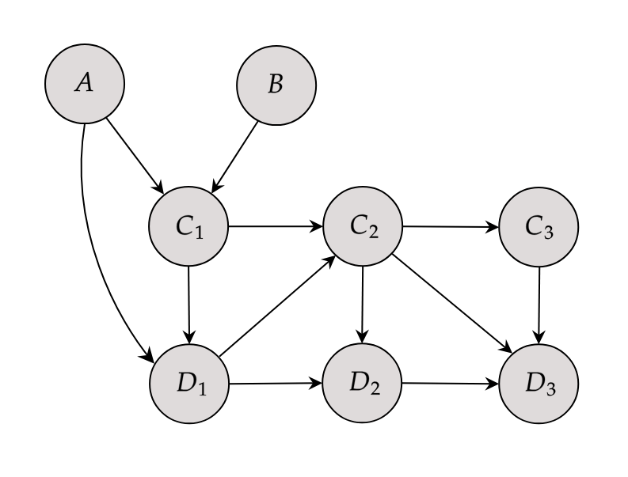

```{r, include=FALSE}
knitr::opts_chunk$set(
  collapse=TRUE,
  comment="#>"
)
```

# Introduction

In this small vignette, we introduce the `sim_from_dag` function, which can be used to simulate complex data from arbitrary causal directed acyclic graphs (DAGs). The simulated data may include continuous, binary, categorical, count or time-to-event variables. This function is most useful if the DAG is static, meaning that there are no time-varying variables. It is theoretically possible to use this function to simulate data from DAGs with a time structure as well, but there are some difficulties associated with it that will be discussed later.

# What are causal DAGs and why use them?

A causal DAG is a DAG in which all nodes correspond to variables and the directed edges correspond to direct causal relationships between these variables. A direct edge from node $A$ to node $B$ implies that there is direct causal effect of $A$ on $B$. On the other hand, if there is no edge from node $A$ to node $B$, there is no direct causal relationship between these variables. Using a DAG in this way makes it easy to encode the causal structure of a given system, which is very useful for causal inference. This general idea is a centerpiece of the **structural approach** to causality developed by Pearl (2002) and Spirtes et al. (1993). We strongly encourage the reader to make themselves familiar with some of this literature before moving on.

It is very simple to generate data from a defined causal DAG. To see why we first need to introduce the concept of **root nodes** and **child nodes**. A root node is a node in a DAG that does not have any edges pointing to it (no incoming arrows). A child node on the other hand is a node that has at least one incoming edge. In other words, root nodes have no direct causes but child nodes do. Every node pointing into another node is considered a **parent** of that child node. For example, consider the DAG in figure 1.

```{r, include=TRUE, fig.align="center", fig.cap=c("A small DAG with four nodes"), echo=FALSE, out.width=400}
knitr::include_graphics("./images_v_sim_from_dag/simple_dag.png")
```

Nodes $A$ and $B$ are root nodes because they do not have any directed edges pointing into them. Nodes $C$ and $D$ on the other hand are child nodes. The parents of node $C$ are both $A$ and $B$ because both of these nodes have directed edge towards $C$. Note that node $B$ is not a parent of node $D$ because there is no edge from $B$ to $D$.

As the name implies, DAGs do not have cycles. Therefore every DAG has at least one root node. Generating data for these nodes is the first step to simulate data for the whole DAG. Since root nodes have no parents, we can simply generate random data from them using an appropriate distribution. Once we have data for all root nodes, we can generate their directly connected child nodes next as a function of the root nodes (and perhaps additional random error). These direct child nodes are then used as input for the next child nodes in line and so on. This continues until every node has been generated. Since every DAG can be topologically sorted (ZITAT), this will *always* work. All we need is to specify the DAG and the functional relationship between each node and its parents. 

# Defining the node lists

Because the `sim_from_dag()` function uses the method described above, it requires information about the causal structure and the exact form of the relationship between child nodes and their parents. All of this information has to included in the `root_nodes` and `child_nodes` arguments. This can be done completely manually (which is the usual strategy when conducting simulation studies) or partially using existing data (which may be useful when the interest is in getting a toy dataset resembling real data as closely as possible).

## Manually

Suppose that node $A$ in the figure above stands for `age`, $B$ stands for `sex`, $C$ stands for the Body-Mass-Index (`BMI`) and $D$ stands for `death`. We have to start by defining what the root nodes should look like. The values for these nodes are simply sampled from some defined distributions. Popular alternatives for continuous data are the normal-, beta-, gamma-distributions which are implemented in base R inside the `rnorm()`, `rbeta()` and `rgamma()` functions. For binary or categorical data we could use `rbernoulli()` or `rcategorical()` instead. We use the following code to define `age` and `sex`:

```{r}
root_nodes <- list(list(dist="rnorm",
                        params=list(mean=50, sd=4),
                        name="age"),
                   list(dist="rbernoulli",
                        params=list(p=0.5),
                        name="sex"))
```

Here, we assume that `age` is a continuous normally distributed variable with a mean of 50 and a standard deviation of 4 (If this was a real simulation study we would probably use a truncated normal distribution to ensure that age is not negative). This can be done by setting the `dist` parameter to `rnorm`, which is the standard R function for generating random values from a normal distribution. All arguments listed in the `params` parameter will be passed to this function. Similarly, we define `sex` to be a bernoulli distributed variable (taking only the values 0/1). We assume that there is an even gender distribution by setting `p = 0.5`.

Next, we have to define what the relationship between the child nodes and their parents should look like. We may use the following code:

```{r}
child_nodes <- list(list(parents=c("sex", "age"),
                         type="gaussian",
                         name="bmi",
                         betas=c(1.1, 0.4),
                         intercept=12,
                         error=2),
                    list(parents=c("age", "bmi"),
                         type="binomial",
                         name="death",
                         betas=c(0.1, 0.3),
                         intercept=-15))
```

Since the `bmi` node is dependent on both `sex` and `age`, we have to list both of these nodes as the parents of `bmi`. We then specify that the `bmi` should be a continuous variable modeled using a linear regression by setting `type="gaussian"`. The concrete regression equation is defined through the use of the `interecept`, `betas` and `error` arguments. Our specification for the `bmi` node corresponds to the following equation:

$$
bmi = 12 + sex \cdot 1.1 + age \cdot 0.4 + N(0, 2),
$$

where $N(0, 2)$ indicates that the error term is modelled as a normally distributed variable with mean 0 and a standard deviation of 2.

Since `death` has only two states (alive vs. dead), we use a logistic regression model here instead. We can do this easily by setting `type="binomial"`. The rest of the syntax essentially stays the same. The regression equation for `death` as described by the code above is then:

$$
logit(death) = -15 + age \cdot 0.1 + bmi \cdot 0.3.
$$

We can now use these node lists to generate random data from this causal DAG using the `sim_from_dag` function:

```{r}
library(simDAG)

set.seed(42)
sim_dat <- sim_from_dag(n_sim=10000, root_nodes=root_nodes,
                        child_nodes=child_nodes)
```

Setting a seed for the random number generator is necessary to obtain replicable results. The data generated using this code looks like this:

```{r}
head(sim_dat, 5)
```

Binary variables such as `sex` and `death` are by default treated as logical variables, because this is the most memory efficient way to store them. We can now check the distributions and relationships in this dataset to confirm that it indeed corresponds to our specified causal DAG. Starting with the root nodes:

```{r fig.width=7, fig.height=5}
hist(sim_dat$age)
```

```{r}
table(sim_dat$sex)
```

This seems to be correct. Note that this is a finite dataset, which means that the results will never *exactly* match the theoretical distributions. But it's definitely close enough here. To check if the child nodes were modeled correctly, we simply fit the corresponding models using the `glm` function:

```{r}
mod_bmi <- glm(bmi ~ age + sex, data=sim_dat, family="gaussian")
summary(mod_bmi)
```

```{r}
mod_death <- glm(death ~ age + bmi, data=sim_dat, family="binomial")
summary(mod_death)
```

Evidently, the coefficients do match the causal coefficients we specified earlier.

## From existing data

If the data should resemble a specific real dataset, it makes sense to base the values for the causal coefficients on that specific dataset. This can be done by fitting a single model for each child node, extracting the estimated coefficients from the fitted models and putting those into an appropriate node list. If the assumed DAG is big, this can be a time-extensive task. The `nodes_from_data` function automates this process. This function takes a node list containing only minimal information about the causal structure and node type and outputs fully specified `root_nodes` and `child_nodes` objects.


# Custom node functions


# Time-varying covariates

```{r, include=TRUE, fig.align="center", fig.cap=c("A small DAG with four nodes"), echo=FALSE, out.width=700}

```

# References


